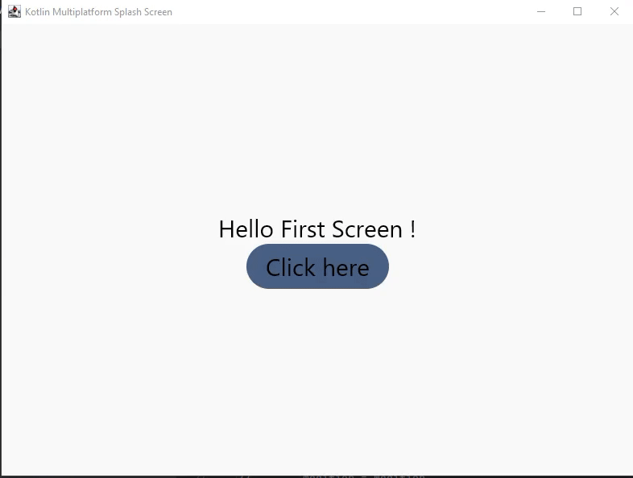
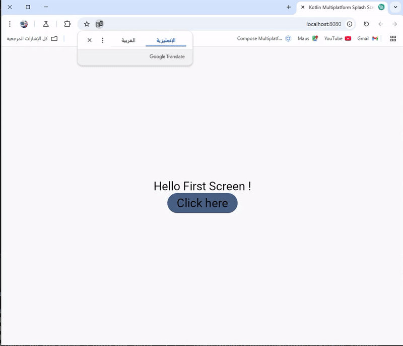

# Compose Multiplatform Application
 
# Example ->  Kotlin-Multiplatform-Navigation-component
In Jetpack Compose, you can use the Navigation component to navigate between screens (also called destinations) and pass parameters.
 Here’s how you can achieve that using the NavController, NavHost, and NavArgument to send and receive parameters.

# [Show Image  ]
 
<html>
<body>
    <h1> Screen Android </h1>
      
</body>
</html>

### Android
To run the application on android device/emulator:  
 - open project in Android Studio and run imported android run configuration

To build the application bundle:
 - run `./gradlew :composeApp:assembleDebug`
 - find `.apk` file in `composeApp/build/outputs/apk/debug/composeApp-debug.apk`
Run android UI tests on the connected device: `./gradlew :composeApp:connectedDebugAndroidTest`

 

<html>
<body>
    <h1> Screen Desktop </h1>
      
</body>
</html>
 

### Desktop
Run the desktop application: `./gradlew :composeApp:run`
Run desktop UI tests: `./gradlew :composeApp:jvmTest`

<html>
<body>
    <h1> Screen Web </h1>
      
</body>

</html>

### JS Browser (Experimental)
Run the browser application: `./gradlew :composeApp:jsBrowserDevelopmentRun --continue`
Run browser UI tests: `./gradlew :composeApp:jsBrowserTest`

### Wasm Browser (Alpha)
Run the browser application: `./gradlew :composeApp:wasmJsBrowserDevelopmentRun --continue`
Run browser UI tests: `./gradlew :composeApp:wasmJsBrowserTest`

### iOS
To run the application on iPhone device/simulator:
- Open `iosApp/iosApp.xcproject` in Xcode and run standard configuration
- Or use [Kotlin Multiplatform Mobile plugin](https://plugins.jetbrains.com/plugin/14936-kotlin-multiplatform-mobile) for Android Studio
  Run iOS simulator UI tests: `./gradlew :composeApp:iosSimulatorArm64Test`
